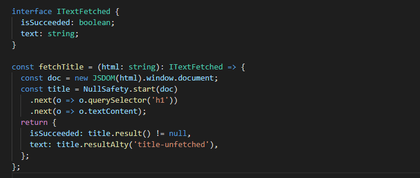
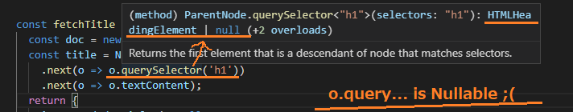
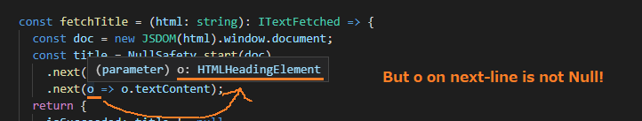

# null-safety

プロパティへの`null-safety`かつ`undefined-safety`かつ型安全かつ連続的な参照をサポートするクラス（を目指したもの）です。

### 利用例：

例えば次の図のように、関数`querySelector`を利用したその結果は`null`や`undefined`かもしれません。
それをチェックすると流れを崩しますし、気にせずずずずずと書きたい時があります。  

そこで関数`next`を利用します。これにより、次の関数`next`において`null`や`undefined`を考慮した冗長なコードを記述する必要がなくなります。  その一方で、代替の値を設定することもできます。  


詳しくは、定義をご参照下さい。

### 型安全：

関数`next`には、次の値取得用の関数を渡し次の値の取得を任せます。利用例で見たように、次の値を取得した結果は`null`や`undefined`でありえることがあります。
  

次の関数`next`では、前の値が`null`や`undefined`であった場合には、次の値取得用の関数を実行せずそのまま元の値を次の値とします。これにより、次の図のように関数`next`へ渡す関数の引数を`null`でない型のみとでき、TypeScriptにおいて有用です。



## 要件

TypeScript のコンパラーオプションにおいて、`strictNullChecks`または`strict`を有効にする必要があります（`strict`は`strictNullChecks`を有効にします）。

```json:tsconfig.json
{
  "compilerOptions": {
    "strict": true,
    "strictNullChecks": true,
    ...
  },
  ...
}
```

## その他の例

```ts
import NullSafety from './null-safety';
import { JSDOM } from 'jsdom';

const htmlA = `
<html>
  <h1>this is page A</h1>
</html>
`;
const htmlB = `
<html>
  <h3>this is page B</h3>
</html>
`;

interface ITextFetched {
  isSucceeded: boolean;
  text: string;
}

const fetchTitle = (html: string): ITextFetched => {
  const doc = new JSDOM(html).window.document;
  const title = NullSafety.start(doc)
    .next(o => o.querySelector('h1'))
    .next(o => o.textContent);
  return {
    isSucceeded: title.result() != null,
    text: title.resultAlty('title-unfetched'),
  };
};

console.log(`title of pageA: ${fetchTitle(htmlA).text}`);
// title of pageA: this is page A

console.log(`title of pageB: ${fetchTitle(htmlB).text}`);
// title of pageB: title-unfetched
```
